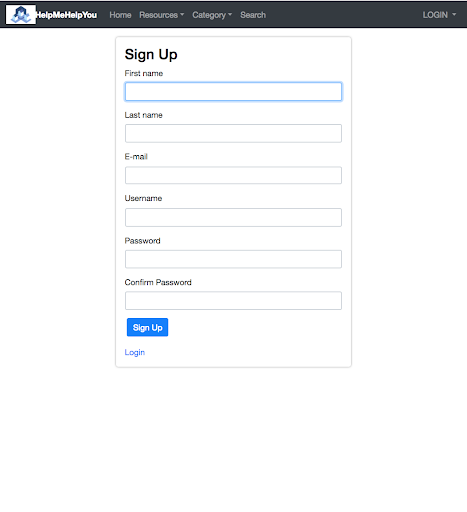

# HelpMeHelpYou

Core Idea: Allows users to help fulfill one another's need. Give what you can and take what you need. Users can join,find what they need and list what they can give.
This application is developed with web2py, a python web framework, with bootstrap on the frontend and a SQL database on the backend

# Home Page

# Sign Up

# Searching for resources

# Adding resources

# Commenting on Needed Resources

